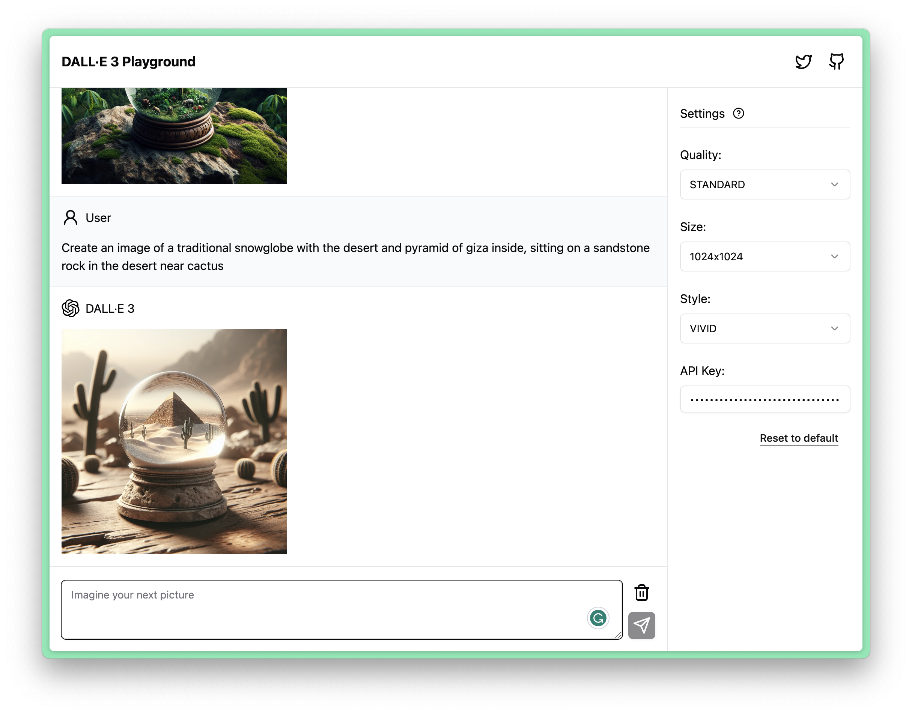

# DALL·E 3 Playground

As of November 20, 2023, DALL·E 3 is not supported by [OpenAI Playground](https://platform.openai.com/playground). Therefore, I have created this playground instead.



[Live Preview](https://dalle3-playground.pages.dev)


## Features

- [x] Gallery mode
- [x] Persistent data
- [x] Responsive UI


## Project Structure

```sh
src
├── app.tsx     # App entry
├── assets      # Assets for images, favicon etc
├── components  # React components
├── hooks       # React hooks
├── i18n        # i18n files
├── lib         # Utils、tools、services
├── main.tsx    # File entry
├── pages       # One .tsx per page
├── router.tsx  # Routers
├── styles      # Less files
├── types       # Typescript types
└── vite-env.d.ts
```


## Dev

```sh
yarn
yarn dev
```

